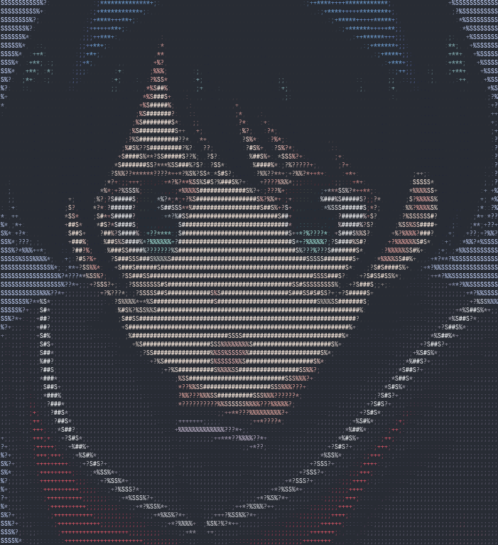

<p align="center">

</p>
<h1 align="center">My personal Website.</h2>

I mostly share my blogposts and information about me in this website. My website is written in JavaSciprt framework named Nuxt3 in top of VueJS. You can run my website in your machine and make changes.

# Usage
Clone
```bash
git clone https://github.com/akumarujon/website
```
```bash
cd website
```
Install && run
```bash
npm install
npm run dev
```

If you are on linux:
```bash
npm install && npm run dev
```

PR are welcomed.(if it worth it.)

# License

This project is licensed under the MIT License - see the [LICENSE](./LICENSE) file for details.
